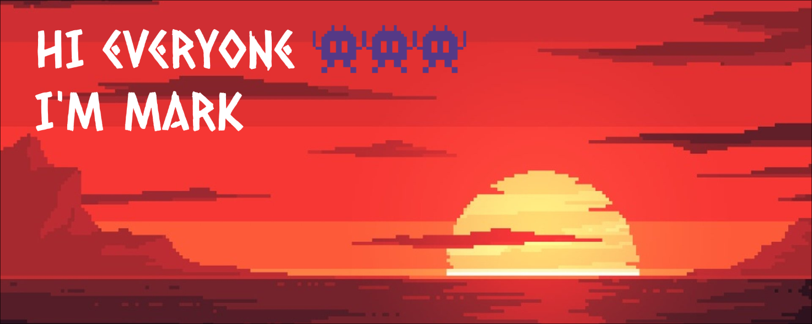

<header>
  
</header>

<h2 align="left"> About me </h2>
<picture name="top-langs">
  <source 
    align="right" height="100%"
    srcset="https://github-readme-stats.vercel.app/api/top-langs?username=tonakihan&show_icons=true&theme=dark&layout=donut&hide_border=true&title_color=53badf&text_color=e2e0cb&bg_color=1a1d1e"
    media="(prefers-color-scheme: dark)"
  />
  <source 
    align="right" height="100%"
    srcset="https://github-readme-stats.vercel.app/api/top-langs?username=tonakihan&show_icons=true&layout=donut"
    media="(prefers-color-scheme: light), (prefers-color-scheme: no-preference)"
  />
  
  </picture>
  
I'm a junior developer, constantly striving for excellence in pursuit of beauty

  

    

      <h2><b>Connect with me</b></h2>
    

  
  
  

  
   

<h2>The best my work</h2>
<a href="https://github.com/tonakihan/BlogPlatform">
  <picture name="pin-repo">
    <source
      srcset="https://github-readme-stats.vercel.app/api/pin?username=tonakihan&theme=dark&hide_border=true&title_color=53badf&text_color=e2e0cb&bg_color=1a1d1e&repo=BlogPlatform"
      media="(prefers-color-scheme: dark)"
    />
    <source
      srcset="https://github-readme-stats.vercel.app/api/pin?username=tonakihan&repo=BlogPlatform"
      media="(prefers-color-scheme: light), (prefers-color-scheme: no-preference)"
    />
    
  </picture>
</a>
